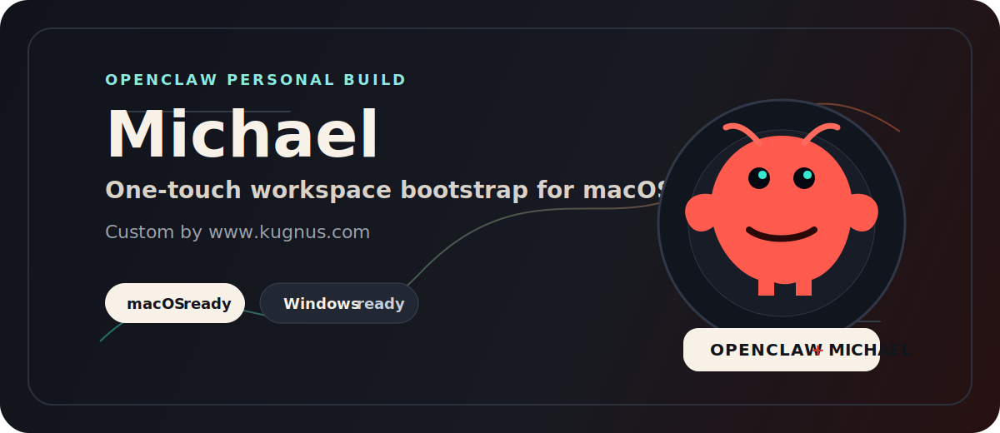

<p align="center">
  
</p>

# Michael for OpenClaw

**김성욱 개인 사용 버전 OpenClaw. 이름은 Michael.**

Michael은 새 Mac이나 Windows PC에 성욱의 OpenClaw 작업환경을 빠르게 붙이기 위한 개인 부트스트랩 키트다.  
작업 규칙, Michael 정체성 파일, 기본 workspace 구조, 검증 스크립트를 한 번에 준비한다.

**커스텀 바이 [www.kugnus.com](https://www.kugnus.com)**

## 한 줄 요약

OpenClaw를 그냥 설치하는 repo가 아니라, **김성욱이 쓰는 방식으로 커스텀된 Michael 작업환경 배포판**이다.

## One-touch Install

### macOS

```bash
git clone https://github.com/souluk319/Michael-bootstrap-OpenClaw-.git michael-bootstrap && cd michael-bootstrap && bash scripts/bootstrap-macos.sh
```

### Windows PowerShell

```powershell
git clone https://github.com/souluk319/Michael-bootstrap-OpenClaw-.git michael-bootstrap; cd michael-bootstrap; powershell -ExecutionPolicy Bypass -File .\scripts\bootstrap-windows.ps1
```

## What This Sets Up

- OpenClaw CLI
- ClawHub CLI
- Git / Node.js / Python checks
- Michael workspace identity files
- Standard project folders
- Local env template without secrets
- macOS / Windows verification scripts

## Included Michael Files

These files are copied into the target workspace:

- `AGENTS.md`
- `SOUL.md`
- `IDENTITY.md`
- `USER.md`
- `TOOLS.md`

Existing files are backed up before replacement.

## Workspace Target

Default workspace path on macOS:

```text
~/.openclaw/workspace
```

Default workspace path on Windows:

```text
%USERPROFILE%\.openclaw\workspace
```

## Verify After Install

### macOS

```bash
bash scripts/verify-macos.sh
```

### Windows

```powershell
powershell -ExecutionPolicy Bypass -File .\scripts\verify-windows.ps1
```

## Secrets Policy

This repo does **not** store secrets.

Do not commit:

- API keys
- OAuth tokens
- Apple account credentials
- Gmail tokens
- GitHub tokens
- production `.env` files
- local message databases

Manual auth still happens after bootstrap:

- GitHub CLI
- Gmail connector or `gog`
- OpenAI / API keys
- iMessage / macOS permissions if needed
- Vercel / Render / Supabase credentials when needed

See [`docs/secrets-and-auth.md`](docs/secrets-and-auth.md).

## Current Status

- macOS installer ready
- Windows installer ready
- workspace config templates included
- verification scripts included
- GitHub remote connected: `https://github.com/souluk319/Michael-bootstrap-OpenClaw-`
- Initial `main` push completed
